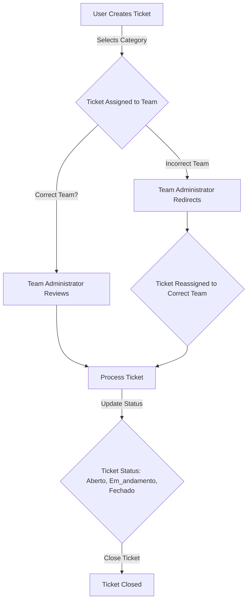

# Ajudaê Project Documentation

## Overview

Ajudaê is a ticket management system designed to streamline support processes. Users can create tickets targeting specific departments, and administrators can manage and redirect tickets to the appropriate team if needed. The system supports one general administrator and one administrator per support team.

### Support Teams

- Marketing
- Produto
- Financeiro
- Other teams (with routes for adding new teams dynamically)

## System Architecture

The backend is built using Prisma with a PostgreSQL database. Below is the Prisma schema that defines the data models and relationships.

### Prisma Schema

```prisma
generator client {
  provider = "prisma-client-js"
}

datasource db {
  provider = "postgresql"
  url      = env("DATABASE_URL")
}

model User {
  id        Int       @id @default(autoincrement())
  name      String
  email     String    @unique
  password  String
  role      Role      @default(USER)
  createdAt DateTime  @default(now())
  updatedAt DateTime  @updatedAt
  lastLogin DateTime?

  ticketsCreated  Ticket[]        @relation("TicketsCreated")
  ticketsAssigned Ticket[]        @relation("TicketsAssigned")
  messages        TicketMessage[]
  teams           UserTeam[]
  session         Session[]

  @@map("user")
}

model Session {
  id           Int    @id @default(autoincrement())
  userId       Int
  ipAddress    String?
  userAgent    String?
  refreshToken String    @unique
  createdAt    DateTime  @default(now())
  expiresAt    DateTime
  revokedAt    DateTime?

  user User @relation(fields: [userId], references: [id])

  @@map("session")
}

model Team {
  id        Int      @id @default(autoincrement())
  name      String
  createdAt DateTime @default(now())
  updatedAt DateTime @updatedAt

  userTeams UserTeam[]
  tickets   Ticket[]

  @@map("team")
}

model UserTeam {
  id        Int      @id @default(autoincrement())
  userId    Int
  teamId    Int
  createdAt DateTime @default(now())

  user User @relation(fields: [userId], references: [id])
  team Team @relation(fields: [teamId], references: [id])

  @@unique([userId, teamId])
  @@map("user_team")
}

model Ticket {
  id        Int            @id @default(autoincrement())
  title     String
  status    TicketStatus
  category  TicketCategory
  priority  TicketPriority
  closedAt  DateTime?
  createdAt DateTime       @default(now())
  updatedAt DateTime       @updatedAt

  createdById  Int
  assignedToId Int?
  teamId       Int?

  createdBy  User            @relation("TicketsCreated", fields: [createdById], references: [id], onDelete: Cascade)
  assignedTo User?           @relation("TicketsAssigned", fields: [assignedToId], references: [id])
  team       Team?           @relation(fields: [teamId], references: [id])
  messages   TicketMessage[]

  @@map("ticket")
}

model TicketMessage {
  id            Int      @id @default(autoincrement())
  ticketId      Int
  senderId      Int
  message       String
  isInternal    Boolean  @default(false)
  attachmentUrl String?
  createdAt     DateTime @default(now())

  ticket Ticket @relation(fields: [ticketId], references: [id])
  sender User   @relation(fields: [senderId], references: [id])

  @@map("ticket_message")
}

enum Role {
  ADMIN
  ATTENDANT
  USER
}

enum TicketStatus {
  Aberto
  Fechado
  Em_andamento
}

enum TicketCategory {
  Financeiro
  Marketing
  Suporte
  Produto
  Outro
}

enum TicketPriority {
  Baixa
  Média
  Alta
}
```

## Routes

The system includes the following API routes:

### Authentication Routes

- `POST /auth/login`: Authenticates a user and returns a session token.
- `POST /auth/refresh`: Refreshes the session token.
- `POST /auth/logout`: Revokes the session token.

### User Routes

- `POST /user/register`: Registers a new user.
- `GET /user`: Retrieves a list of users (admin only).
- `GET /user/:id`: Retrieves a specific user by ID.
- `PUT /user/:id`: Updates a user's details.
- `DELETE /user/:id`: Deletes a user (admin only).

## Ticket System Workflow

Users can create tickets targeting a specific department (e.g., Marketing, Produto, Financeiro). Each team has one administrator who can:

- Review tickets assigned to their team.
- Redirect tickets to another team if the category is incorrect.
- Update ticket status (`Aberto`, `Em_andamento`, `Fechado`) and priority (`Baixa`, `Média`, `Alta`).

The general administrator oversees the entire system and can manage all tickets and teams.

### Workflow Diagram



## Setup Instructions

To run the Ajudaê server, follow these steps:

1. **Install Docker**: Ensure Docker is installed on your computer. Download and install it from [Docker's official website](https://www.docker.com/get-started) if not already installed.
2. **Run the Server**: Execute the following command in the project directory to start the server using Docker Compose:
   ```bash
   docker compose up
   ```
   This will build and run the necessary containers for the application and database.
3. **Environment Variables**: Ensure a `.env` file is configured with the `DATABASE_URL` for the PostgreSQL database.
4. **Access Documentation**: Once the application is online, visit the API documentation at:
   ```
   http://localhost:3000/docs
   ```

## Next Steps

- Implement ticket creation and management routes.
- Add functionality for administrators to redirect tickets.
- Enhance the UI for ticket creation and tracking.
